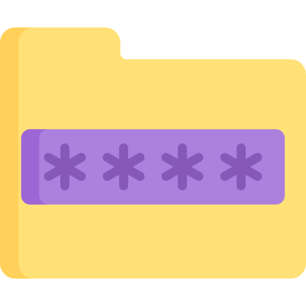
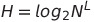
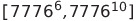
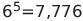
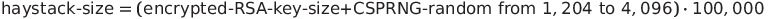

</img>

# Enigma EFS
<p align="justify"><i>Cryptography and Computer Protection</i> course project, as taught at the Faculty of Electrical Engineering Banja Luka. <b>Enigma EFS</b> is a WPF application written in C# that simulates an Encrypted File System.
</p>

## Table of contents
- [Enigma EFS](#enigma-efs)
  - [Table of contents](#table-of-contents)
  - [Acronyms](#acronyms)
  - [Name origin](#name-origin)
  - [Usage](#usage)
    - [Register](#register)
    - [Login](#login)
      - [Login attempt limit](#login-attempt-limit)
      - [Nuclear switch](#nuclear-switch)
    - [File encryption](#file-encryption)
    - [File decryption](#file-decryption)
    - [File sharing](#file-sharing)
    - [File updating](#file-updating)
  - [Encrypted file](#encrypted-file)
    - [Enigma EFS Encrypted File Attribute Types](#enigma-efs-encrypted-file-attribute-types)
      - [Layout of the Standard Information](#layout-of-the-standard-information)
      - [Layout of the Security Descriptor](#layout-of-the-security-descriptor)
      - [Layout of the Data](#layout-of-the-data)
  - [Algorithms](#algorithms)
    - [Symmetric algorithms](#symmetric-algorithms)
    - [Asymmetric algorithm](#asymmetric-algorithm)
    - [Hashing algorithms](#hashing-algorithms)
  - [Username](#username)
  - [Passwords and keys](#passwords-and-keys)
    - [Password guidelines](#password-guidelines)
    - [Password Entropy](#password-entropy)
    - [Passphrase](#passphrase)
    - [Password protection and storage](#password-protection-and-storage)
      - [Key streching](#key-streching)
    - [RSA key encryption and hidding](#rsa-key-encryption-and-hidding)
      - [<i>Needle in a Haystack</i> Steganography](#ineedle-in-a-haystacki-steganography)
        - [Haystack structure](#haystack-structure)
  - [Certificate policies](#certificate-policies)
  - [Limitations and restrictions](#limitations-and-restrictions)
  - [Potential problems and known security bugs](#potential-problems-and-known-security-bugs)
  - [Screenshots](#screenshots)
  - [To-Do List](#to-do-list)
  - [References](#references)
    - [Books](#books)
    - [Links](#links)
    - [Github projects](#github-projects)

## Acronyms
 <table>
  <tr>  <td>NIST</td>   <td>National Institute of Standards and Technology</td> </tr>
  <tr>    <td>SHA</td>    <td>Secure Hash Algorithm</td>  </tr>
  <tr>    <td>KDF</td>    <td>Key Derivation Function</td>  </tr>
  </tr>    <td>PBKDF2</td>    <td>Password-Based KDF 2</td>  </tr>
  <tr>    <td>MAC</td>    <td>Message Authentication Code</td>  </tr>
  <tr>    <td>HMAC</td>    <td>Keyed-hash Message Authentication Code</td>  </tr>
  <tr>    <td>PRNG</td>    <td>Pseudorandom Number Generator</td>  </tr>
  <tr>    <td>CSPRNG</td>    <td>Cryptographically Secure PRNG</td>  </tr>
  <tr>    <td>ECB</td>    <td>Electronic Codebook</td>  </tr>
  <tr>    <td>CBC</td>    <td>Cipher Block Chaining</td>  </tr>
  <tr>    <td>CFB</td>    <td>Cipher Feedback</td>  </tr>
  <tr>    <td>OFB</td>    <td>Output Feedback</td>  </tr>
  <tr>    <td>IV</td>    <td>Initialization Vector</td>  </tr>
  <tr>    <td>PKI</td>    <td>Public Key Infrastructure</td>  </tr>
  <tr>    <td>PKIX</td>    <td>Public Key Infrastructure X.509</td>  </tr>
  <tr>    <td>FS</td>    <td>File System</td>  </tr>
  <tr>    <td>EFS</td>    <td>Encrypted FS</td>  </tr>
  <tr>    <td>2FA</td>    <td>Two-factor Authentication</td>  </tr>
  <tr>    <td>RSA</td>    <td>Rivest-Shamir-Adleman algorithm</td>  </tr>
  <tr>    <td>AES</td>    <td>Advanced Encryption Standard</td>  </tr>
  <tr>    <td>3DES</td>    <td>Triple Data Encryption Standard</td>  </tr>
</table>

## Name origin
<p align="justify">While learning about history of cryptography and cryptanalysis I've learned more about the <a href="https://en.wikipedia.org/wiki/Enigma_machine">Enigma machine</a> and <a href="https://en.wikipedia.org/wiki/Alan_Turing">Alan Turing</a>. Naturally I choose to name this project Enigma and encrypted files have an extension <code>.at</code>.</p>

## Usage
### Register
<p align="justify">To use the application user first needs to register. User needs to provide an unique <i>Username</i>, <i>Password</i> and his <i><a href="">X.509</a> Public Certificate</i>. Users <i>Username</i>, hashed <i>Password</i> value and his public <a href="https://en.wikipedia.org/wiki/RSA_(cryptosystem)">RSA</a> key extracted from provided certificate will be stored in Enigmas database.<br><br>When registering, user has an option to have his password created for him. The password are generated by <a href="https://en.wikipedia.org/wiki/Cryptographically_secure_pseudorandom_number_generator">CSPRNG</a> and are guaranteed to have high <a href="https://en.wikipedia.org/wiki/Password_strength#Entropy_as_a_measure_of_password_strength">entropy</a>. User can also choose to use a random <a href="https://en.wikipedia.org/wiki/Passphrase">passphrase</a> generated by Enigma based on <a href="https://en.wikipedia.org/wiki/Diceware">Diceware</a>.
</p>

### Login
<p align="justify">To access <b>Enigmas EFS</b> user needs to login first. Login process is realizes as <a href="https://en.wikipedia.org/wiki/Multi-factor_authentication">2FA</a>. At first, user needs to provide <i>Username</i> and <i>Password</i> (something only user knows). If the entered password matches the hash value stored for the user in the Enigmas database, user will be prompted to provide his certificate (something only the user has). After checking if the given certificate matches the public key stored in the database, certificate is subjected to furter verifications. If the login attempt is successful, user is granted access to EFS.
</p>

#### Login attempt limit
<p align="justify">Every user has a total of three opportunities to enter his password. After three failed attempts, a "nuclear switch" is turned on and users data is deleted.</p>

#### Nuclear switch
<p align="justify">This functionality is implemented to add more security to users files. In addition to deleting user files, users account is locked preventing him to login to Enigmas EFS. Only an admin can unlock an user account. Unlocking process is followed with a mandatory user password change.</p>

### File encryption
<p align="justify">Files are encrypted using one of the symmetric algorithm.</p>


<p align="justify"></p>


### File decryption

### File sharing

### File updating

## Encrypted file
<p align="justify"><b>Enigma EFS</b> views each encrypted file as a set of file attributes. File elements such as its name, its security information, and even its data are file attributes. Each attribute is identified by an attribute type code stored as an <code>enum</code>.</p>

```C#
public enum AttributeType : uint
{
    Unkown = 0,
    STANDARD_INFORMATION = 0x10,
    SECURITY_DESCRIPTOR = 0x50,
    DATA = 0x80,
} 
```

### Enigma EFS Encrypted File Attribute Types
Attribute Type | Attribute Name | Description
--- | --- | ---
0x10 | Standard Information | Information such as access mode (read-only, read/write, and so forth) timestamp, and link count.
0x50 | Security Descriptor | 
0x80 | Data | File data. NTFS supports multiple data attributes per file. Each file typically has one unnamed data attribute. A file can also have one or more named data attributes.

#### Layout of the Standard Information
Offset | Size<br>(bytes) | Description
--- | --- | ---
0x00 | 4 | Attribute Type (0x10)
0x04 | 4 | Total Length
0x08 | 8 | C Time - File Creation
0x10 | 4 | Owner Id
0x14 | 8 | A Time - File Altered
0x1c | 4 | A Time User Id
0x20 | 8 | R Time - File Read
0x28 | 4 | R time User Id
> Total size of this header is 44 bits.

#### Layout of the Security Descriptor
Offset | Size<br>(bytes) | Description
--- | --- | ---
0x000 | 4 | Attribute Type (0x50)
0x004 | 1 | Algorithm Name Signature Length
0x005 | 11 - 13 | Algorithm Name Signature (e.q. AES-256-CBC)
0x010 | 1 | Hash Algorithm Name Length
0x011 | 3 - 10 | Hash Algorithm Name (e.q. SHA256)
0x017 | 1 | IV length
0x018 | 8 or 16 | IV
0x028 | 4 | Owner Id
0x02c | 4 | Number of users that have access to the file<br>(max. 4 users) - e.q. only a file owner has access to the file
0x030 | 4 | User Id
0x034 | 4 | Encrypted Key Length
0x038 | 256, 384 or 512 | Encrypted Key<br>(e.q. 256 when user has 2048 bits RSA key)
0x138 | 4 | RSA Signature Length
0x13c | 256, 384 or 512 | RSA Signature

#### Layout of the Data
Offset | Size<br>(bytes) | Description
--- | --- | ---
0x00 | 4 | Attribute Type (0x80)
0x04 | up to 2 GB | Encrypted Data

## Algorithms
### Symmetric algorithms
List of symmetric encryption algorithms that are implemented in <b>Enigma EFS</b>.
ALGORITHM<br>NAME | BLOCK CIPHER<br>MODE OF OPERATION | KEY SIZE<br>(bits) | BLOCK<br>SIZE (bits)
| --- | :---: | :---: | :---:
<a href="https://en.wikipedia.org/wiki/Advanced_Encryption_Standard">AES</a> | <a href="https://en.wikipedia.org/wiki/Block_cipher_mode_of_operation#Electronic_codebook_(ECB)">ECB</a>, <a href="https://en.wikipedia.org/wiki/Block_cipher_mode_of_operation#Cipher_block_chaining_(CBC)">CBC</a>, <a href="https://en.wikipedia.org/wiki/Block_cipher_mode_of_operation#Cipher_feedback_(CFB)">CFB</a>, <a href="https://en.wikipedia.org/wiki/Block_cipher_mode_of_operation#Output_feedback_(OFB)">OFB</a> | 128, 192 and 256 | 128
<a href="https://en.wikipedia.org/wiki/Camellia_(cipher)">Camellia</a> | ECB, CBC, CFB, OFB | 128, 192 and 256 | 128 
<a href="https://en.wikipedia.org/wiki/Triple_DES">3DES</a> | ECB, CBC, CFB, OFB | 192 | 64
<a href="https://www.schneier.com/academic/archives/1998/12/the_twofish_encrypti.html">Twofish</a> | ECB, CBC, CFB, OFB | 128, 192 and 256 | 128
> **_NOTE:_**
> <p align="justify"> I don't recomment ECB mode because it's not <a href="https://en.wikipedia.org/wiki/Semantic_security">semantically secure</a>. The only time it could be safe to use is if its used for encryption of data smaller than 128 bits when using with AES, Camellia or Twofish, or 64 bits when using with 3DES.</p>

### Asymmetric algorithm
RSA cryptosystem is the only asymmetric algorithm implemented. It's used for symmetric key encryption and for generating a digital signature of files.

### Hashing algorithms
Hashing algorithms that are implemented in <b>Enigma EFS</b>.

Algorithm | Variant | Output size<br>(bits)
| --- | :---: | :---:
<a href="https://en.wikipedia.org/wiki/MD2_(hash_function)">MD2</a> | x | 128
<a href="https://en.wikipedia.org/wiki/MD4">MD4</a> | x | 128
<a href="https://en.wikipedia.org/wiki/MD5">MD5</a> | x | 128
<a href="https://en.wikipedia.org/wiki/SHA-1">SHA-1 | x | 160
<a href="https://en.wikipedia.org/wiki/SHA-2">SHA-2</a> | SHA-224<br>SHA-256<br>SHA-384<br>SHA-512 | 224<br>256<br>384<br>512
<a href="https://en.wikipedia.org/wiki/RIPEMD">RIPEMD</a> | RIPEMD-128<br>RIPEMD-160<br>RIPEMD-256 | 128<br>160<br>256
<!-- <a href="https://en.wikipedia.org/wiki/SHA-3">SHA-3</a> | SHA3-224<br>SHA3-256<br>SHA3-384<br>SHA3-512 | 224<br>256<br>384<br>512 -->

> **_NOTE:_**
> <p align="justify"> MD5 and SHA1 <b>MUST NOT</b> be used for cryptographic hash functions. Keep in mind that RIPEMD-128 and RIPEMD-160 aren't considered secure because message digest of (at least) 224 bits must be used. RIPEMD-256 isn't recommended by NIST, so caution is advised when using it. Also, MD2 and MD4 are obsolete.</p>

## Username
<p align="justify">Usernames are provided by the user when registering. After having a talk with my professor, I've came to conclusion that a better approach to username creation would be to add random numbers to every username. This will make a <a href="https://en.wikipedia.org/wiki/Brute-force_attack">brute force attack</a> on users account more difficult and it will also allow duplicate usernames usage. Probability of a collision when using the same username is 0.0001. If the collision does happen, user should try to register again with the same username (probability of a two consecutive collisions is 0.00000001).<br><br>I've used a similar approach to creating usernames as <a href="https://en.wikipedia.org/wiki/Discord_(software)">Discord</a>. Each username is assigned a four-digit number, prefixed with '#', which is added to the end of their username. E.q. if you choose a username <i>myname</i>, than your final username will look something like <i>myname#5642</i>.</p>

## Passwords and keys
### Password guidelines
<p align="justify">Guidelines for choosing good passwords are typically designed to make passwords harder to discover by intelligent guessing. All the guidelines are NIST compliant.<p>
<ol>
    <li><p align="justify">Memorized secrets are at least 8 characters in length not including spaces.</p></li>
    <li><p align="justify">Passwords are only required to be changed if there is evidence of compromise.</p></li>
    <li><p align="justify">New passwords are screened against a <a href="https://github.com/AleksaMCode/Enigma/blob/master/Enigma/10-million-password-list-top-1000000.txt">list</a> of known compromised passwords.</p></li>
    <li><p align="justify">New passwords can't contain username.</p></li>
    <li><p align="justify">Password hints and knowledge-based security questions are not implemented.</p></li>
    <li><p align="justify">Maximum password length is set 200 characters (NIST minimum is 64).</p></li>
    <li><p align="justify">Passwords can contain all printable ASCII characters including a space character.</p></li>
</ol>

### Password Entropy
<p align="justify">In <b>Enigma EFS</b> password strength is specified in terms of <a href="https://en.wikipedia.org/wiki/Entropy_(information_theory)">entropy</a> (concept from <a href="https://en.wikipedia.org/wiki/Information_theory">information theory</a>) which is measured in bits. For passwords generated by a process that randomly selects a string of symbols of length, L, from a set of N possible symbols, the number of possible passwords can be found by raising the number of symbols to the power L. Increasing either L or N will strengthen the generated password. The strength of a random password as measured by the <a href="https://en.wikipedia.org/wiki/Claude_Shannon">Shannons</a> entropy is just the base-2 logarithm of the number of possible passwords, assuming each symbol in the password is produced independently. Random password's information entropy, H, is given by the formula:</p>
<p align="center">.</p>
<p align="justify">Entropy per symbol for different symbol sets:</p>

SYMBOL SET | SYMBOL<br>COUNT | ENTROPY PER<br>SYMBOL
--- | :---: | ---
Arabic numbers (0-9) | 10 | 3.322 bits
Case insensitive Latin alphabet<br>(a–z or A–Z) | 26 | 4.700 bits
Case insensitive alphanumeric<br>(a–z or A–Z, 0–9) | 36 | 5.170 bits
Case sensitive Latin alphabet<br>(a–z, A–Z) | 52 | 5.700 bits
Case sensitive alphanumeric<br>(a–z, A–Z, 0–9) | 65 | 5.954 bits
All ASCII printable characters | 95 | 6.570 bits
Diceware word list | 7776 | 12.925 bits<br>per word

> **_NOTE:_**
> <p align="justify">NIST recommends dropping the arbitrary password complexity requirements needing mixtures of upper case letters, symbols and numbers. Based on cracking real-world passwords conclude "<i>notion of password entropy...does not provide a valid metric for measuring the security provided by password creation policie</i>". However, I have implemented Shannon's entropy in <b>Enigma EFS</b> despite it not being a good predictor of how quickly attackers can crack passwords.</p>

### Passphrase
<p align="justify">A passphrase is a sequence of randomly chosen words. It is similar to password in usage, but is generally longer. <b>Enigma EFS</b> offers random generated passphrases based on diceware. While such a collection of words might appear to violate the "not from any dictionary" rule, the security is based entirely on the large number of possible ways to choose from the list of words and not from any secrecy about the words themselves. There are in total 7,776 words in the list (<a href="https://en.wikipedia.org/wiki/Electronic_Frontier_Foundation">EFF</a> wordlist) and anywhere between 6 and 10 words are chosen randomly which gives us a combination domain of , that provides anywhere from 78 to 128 bits of entropy.
Number 7,776 () was chosen to allow words to be selected by throwing dice five times.  Every dice throw is simulated by CSPRNG.
As an additional security random delimiter with random length, that varies between 3 and 5 charters (ASCII chars between 0x20 and 0x41), is used.</p>

### Password protection and storage

#### Key streching
<p align="justify">A supplementary approach to frustrating brute-force attacks is to derive the key from the password/passphrase using a deliberately slow hash function. <b>Enigma EFS</b> uses NIST recommended key derivation function <a href="https://en.wikipedia.org/wiki/PBKDF2">PBKDF2</a>. One weakness of PBKDF2 is that while its number of iterations can be adjusted to make it take an arbitrarily large amount of computing time, it's not a memory-hard function. A function that is not only time-hard but also memory-hard like <a href="https://en.wikipedia.org/wiki/Balloon_hashing">Balloon</a> or <a href="https://en.wikipedia.org/wiki/Argon2">Argon2</a> could add more security to the system.</p>

### RSA key encryption and hidding
<p align="justify">When first creating an account, every user is prompted to encrypt his private RSA key using his password. Unlike a user account password, RSA password doesn't need to have a high entropy. The only limitation is that is has to be at least 8 characters long. Every RSA key is encrypted using AES-256-OFB algorithm. Key and Iv are derived from the users password using a SHA-512 hashing algorithm.</p>

#### <i>Needle in a Haystack</i> Steganography
<p align="justify">After encryption, encrypted RSA key is hidden in a haystack of CSPRNG random data which is than stored on FS or on a user USB. Haystack size is always random and its size is given by the formula:</p>
<p align="center"></p>
<p align="justify">The idea was to hide a block of useful data in a much larger block of random data which will virtually indistinguishable from our hidden data. Given that description, a better name would perhaps be a <i>needle in a stack of needles</i>. Does this actually increase the security of the private key? I'm not really sure, there is good chance this is a good example of <a href="https://en.wikipedia.org/wiki/Security_theater">security theater</a>. What I do know is that the private RSA key should be secure as long as the users password is strong and kept a secret. If users RSA key is stored on a USB it should have an added security advantage compared to key stored on FS duo to <a href="https://en.wikipedia.org/wiki/Physical_security">physical security</a>.</p>

##### Haystack structure
<p align="justify">Haystack contains, starting from a first bit of data, encrypted RSA key randomly chosen starting location in a haystack stored as an integer, size of the encrypted RSA key stored as an integer, user passwords salt stored in next 16 bytes of data, user password digest stored in next 32 bytes of data and the encrypted RSA key stored at the appropriate location.</p>

## Certificate policies

## Limitations and restrictions
* <p align="justify">User can't store files larger than 2 GB.</p>
* <p align="justify">User can only store <code>.txt</code>, <code>.doc</code>, <code>.docx</code>, <code>.pdf</code>, <code>.xls</code>, <code>.xlsx</code>, <code>.ppt</code>, <code>.pptx</code>, <code>.png</code>, <code>.jpg</code> and <code>.jpeg</code> files.</p>
* <p align="justify">Only a file owner can share/unshare, update and delete a file.</p>
* <p align="justify">Minimum RSA key size permited is 2,048 bits long.</p>

## Potential problems and known security bugs
<dl>
<ul>
    <li><dt>RSA key usage</dt>
    <dd><p align="justify">RSA keys are used both for encryption and file signing.</p></dd></li>
</ul>
<ul>
  <li><dt>Encryption using ECB mode</dt>
  <dd><p align="justify">When updating already encrypted file, only IV value is changed while the KEY remains the same. This is potentially a problem when using a ECB mode which doesn't requires IV. An attacker who is observing different versions of the encrypted file can perhaps deduce an opentext.</p></dd></li>
</ul>
<ul>
  <li><dt>3DES encryption</dt>
  <dd><p align="justify">Please be mindful when using 3DES encryption as it only provides 112 bit security, not 192 bits (168 bits), due to <a href="https://en.wikipedia.org/wiki/Meet-in-the-middle_attack"><i>meet-in-the-middle attack</i></a>.</p></dd></li>
</ul>
</dl>

## Screenshots

## To-Do List
- [ ] Implement encryption of large files.
  - [ ] Remove 2 GB file size restriction.
  - [ ] Remove file type limitations.
- [ ] ~~Implement SHA-3 hashing (-224,-256,-384 and -512).~~
- [ ] Implement [trusted timestamping](https://en.wikipedia.org/wiki/Trusted_timestamping) and TSA.
- [ ] Implement re-login process after 5 minutes of inactivity.
- [ ] Implement *forgot password* functionality.

## References
### Books
<ul>
    <li><p align="justify">Dirk Strauss - <i>Cryptography in .NET</i></p></li>
    <li><p align="justify"><a href="http://dubeyko.com/development/FileSystems/NTFS/ntfsdoc.pdf">Richard Russon, Yuval Fledel - <i>NTFS Documentation</i></a></p></li>
    <li><p align="justify">Michael Welschenbach - <i>Cryptography in C and C++</i></p></li>
    <li><p align="justify">William Stallings - <i>Cryptography and Network Security: Principles and Practice</i></p></li>
    <li><p align="justify">John F. Dooley - <i>History of Cryptography and Cryptanalysis: Codes, Ciphers, and Their Algorithms</i></p></li>
    <li><p align="justify">Bruce Schneier, Niels Ferguson, Tadayoshi Kohno - <i>Cryptography Engineering: Design Principles and Practical Applications</i></p></li>
</ul>

### Links
### Github projects
Some of the projects that **Enigma EFS** uses, either directly or indirectly.
- [Cryptor](https://github.com/Valyreon/cryptor-wpf-project)
- [SecLists](https://github.com/danielmiessler/SecLists)
- [RSA keys](https://gist.github.com/valep27/4a720c25b35fff83fbf872516f847863)
- [Bouncy Castle](https://github.com/bcgit/bc-csharp)
- [NTFS simulator](https://github.com/AleksaMCode/ntfs-simulator)